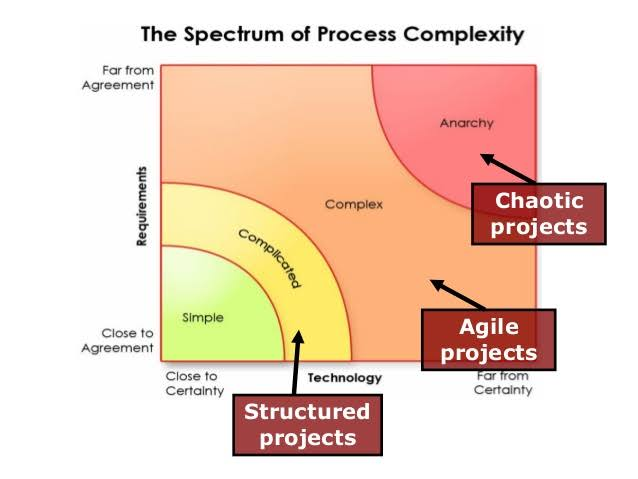

# Complex Problem Solution Tips :zap:

There are several approaches that you can take to find a simple solution to a complex problem:

- **Break the problem down into smaller, more manageable pieces**: By breaking the problem down into smaller parts, you can focus on solving one piece at a time, rather than trying to tackle the entire problem at once.

- **Identify the core of the problem**: Try to understand the root cause of the problem, rather than just the symptoms. This can help you to find a solution that addresses the underlying issue, rather than just treating the symptoms.

- **Use a step-by-step approach**: Break the problem-solving process down into a series of smaller steps. This can help you to stay organized and focused, and make it easier to see progress as you work through the problem.

- **Look for patterns and trends**: Look for patterns and trends in the data or information related to the problem. These patterns can often provide clues as to the underlying cause of the problem, and help you to develop a solution.

- **Seek out outside perspectives**: Sometimes, it can be helpful to get input from others who have experience or expertise in the area. This can provide new insights and ideas that you may not have considered.

- **Stay positive and persistent**: Solving complex problems can be challenging, but it's important to stay positive and keep trying. Don't get discouraged if you don't find a solution right away – keep working at it and you'll eventually find a solution that works.
